<h3><code>nag@github ~ $ whoami</code></h3>
<table>
<tr>
<td valign="top"></td>
<td valign="top"></td>
</tr>
</table>
  
<h3><code>nag@github ~ $ ./contributions.sh</code></h3>

  
<h3><code>nag@github ~ $ ./links.sh</code></h3>

<b>Software Engineer · Backend & Platform · GenAI Tooling</b>

 

